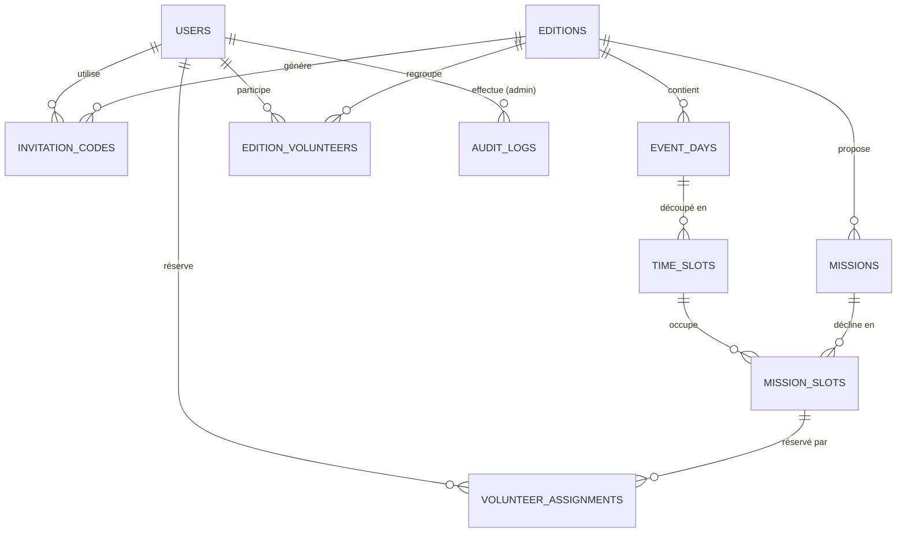

# Dictionnaire de données — Plateforme de gestion des bénévoles

Ce document décrit le schéma de base de données dérivé du [cahier des charges](CAHIER_DES_CHARGES.md). Il sert de référence avant l'écriture des migrations Laravel/MySQL et sera mis à jour à chaque évolution du schéma.

## Conventions

- SGBD : MySQL 8.0.
- Toutes les tables ont `id` (BIGINT UNSIGNED, clé primaire auto-incrémentée) sauf mention contraire.
- Toutes les tables ont `created_at` / `updated_at` (TIMESTAMP, gérés par Eloquent) sauf mention contraire — non listés colonne par colonne ci-dessous pour alléger la lecture.
- `FK` = clé étrangère. Sauf mention contraire, suppression en `CASCADE` quand l'enfant n'a pas de sens sans son parent (ex : `time_slots` sans `event_days`), et en `RESTRICT`/`SET NULL` quand la donnée doit être conservée pour la traçabilité (ex : logs d'audit).

## Vue d'ensemble (diagramme relationnel)

## Tables

### `editions`

Une édition du Salon (architecture multi-éditions, archivage des éditions passées).

| Champ | Type | Contraintes | Description |
|---|---|---|---|
| id | BIGINT UNSIGNED | PK | |
| name | VARCHAR(255) | NOT NULL | Ex : "Salon de la Danse 2027" |
| slug | VARCHAR(255) | UNIQUE, NOT NULL | Pour les URLs/exports |
| start_date | DATE | NOT NULL | Premier jour du Salon |
| end_date | DATE | NOT NULL | Dernier jour du Salon |
| registration_opens_at | DATETIME | NULLABLE | Début de la fenêtre d'inscription |
| registration_closes_at | DATETIME | NULLABLE | Fin de la fenêtre d'inscription |
| is_registration_locked | BOOLEAN | DEFAULT FALSE | Verrouillage manuel admin, indépendant des dates |
| min_slots_per_volunteer | TINYINT UNSIGNED | DEFAULT 1 | Quota mini de créneaux |
| max_slots_per_volunteer | TINYINT UNSIGNED | DEFAULT 3 | Quota maxi de créneaux |
| max_consecutive_slots | TINYINT UNSIGNED | DEFAULT 2 | Nb max de créneaux consécutifs sans pause |
| status | ENUM('draft','active','archived') | DEFAULT 'draft' | Cycle de vie de l'édition |

### `invitation_codes`

Codes d'invitation générés hors plateforme (suite à la sélection Google Forms), qui conditionnent l'accès à l'inscription.

| Champ | Type | Contraintes | Description |
|---|---|---|---|
| id | BIGINT UNSIGNED | PK | |
| edition_id | BIGINT UNSIGNED | FK → editions.id, NOT NULL | Édition concernée |
| code | VARCHAR(32) | UNIQUE, NOT NULL | Code fourni au candidat par e-mail |
| email | VARCHAR(255) | NULLABLE | Pré-assignation optionnelle à un e-mail précis |
| status | ENUM('pending','used','revoked') | DEFAULT 'pending' | État du code |
| used_by_user_id | BIGINT UNSIGNED | FK → users.id, NULLABLE | Bénévole ayant consommé le code |
| used_at | DATETIME | NULLABLE | |
| expires_at | DATETIME | NULLABLE | |
| created_by_id | BIGINT UNSIGNED | FK → users.id, NULLABLE | Admin ayant généré/importé le code |

### `users`

Comptes bénévoles **et** administrateurs (rôle distingué par `role`). Un compte = une personne (unicité sur l'e-mail).

| Champ | Type | Contraintes | Description |
|---|---|---|---|
| id | BIGINT UNSIGNED | PK | |
| first_name | VARCHAR(255) | NOT NULL | |
| last_name | VARCHAR(255) | NOT NULL | |
| email | VARCHAR(255) | UNIQUE, NOT NULL | |
| phone | VARCHAR(20) | NOT NULL | |
| password | VARCHAR(255) | NOT NULL | Hash |
| photo_path | VARCHAR(255) | NULLABLE | Requis fonctionnellement avant validation du profil (badge) |
| role | ENUM('admin','volunteer') | DEFAULT 'volunteer' | |
| is_minor | BOOLEAN | DEFAULT FALSE | |
| minor_validated_at | DATETIME | NULLABLE | Validation manuelle du profil mineur par un admin |
| profile_locked_at | DATETIME | NULLABLE | Dès renseigné, seul un admin peut modifier nom/e-mail/photo/etc. |
| email_verified_at | DATETIME | NULLABLE | Standard Laravel |
| remember_token | VARCHAR(100) | NULLABLE | Standard Laravel |

### `event_days`

Jours de l'édition (vendredi/samedi/dimanche).

| Champ | Type | Contraintes | Description |
|---|---|---|---|
| id | BIGINT UNSIGNED | PK | |
| edition_id | BIGINT UNSIGNED | FK → editions.id, NOT NULL | |
| date | DATE | NOT NULL | |
| label | VARCHAR(50) | NOT NULL | Ex : "Vendredi" |
| | | UNIQUE(edition_id, date) | |

### `time_slots`

Créneaux de 2h au sein d'un jour (5 par jour).

| Champ | Type | Contraintes | Description |
|---|---|---|---|
| id | BIGINT UNSIGNED | PK | |
| event_day_id | BIGINT UNSIGNED | FK → event_days.id, NOT NULL | |
| starts_at | TIME | NOT NULL | Ex : 08:30:00 |
| ends_at | TIME | NOT NULL | Ex : 10:00:00 |
| position | TINYINT UNSIGNED | NOT NULL | Ordre d'affichage (1 à 5), sert aussi à détecter l'enchaînement de créneaux consécutifs |
| | | UNIQUE(event_day_id, position) | |

### `missions`

Postes proposés sur une édition (Accueil exposants, Vestiaires, etc.).

| Champ | Type | Contraintes | Description |
|---|---|---|---|
| id | BIGINT UNSIGNED | PK | |
| edition_id | BIGINT UNSIGNED | FK → editions.id, NOT NULL | |
| name | VARCHAR(255) | NOT NULL | |
| description | TEXT | NULLABLE | Consignes affichées au bénévole |
| is_public | BOOLEAN | DEFAULT TRUE | `false` pour les postes sensibles (Billetterie, Caisse) : hors-planning public, attribution manuelle uniquement |

### `mission_slots`

Jauge : capacité d'une mission sur un créneau donné.

| Champ | Type | Contraintes | Description |
|---|---|---|---|
| id | BIGINT UNSIGNED | PK | |
| mission_id | BIGINT UNSIGNED | FK → missions.id, NOT NULL | |
| time_slot_id | BIGINT UNSIGNED | FK → time_slots.id, NOT NULL | |
| capacity | SMALLINT UNSIGNED | NOT NULL | Capacité max paramétrable ; sert de base au code couleur (vert/orange/rouge selon taux de remplissage) |
| | | UNIQUE(mission_id, time_slot_id) | |

### `volunteer_assignments`

Réservation d'un bénévole sur une mission/créneau (le planning lui-même).

| Champ | Type | Contraintes | Description |
|---|---|---|---|
| id | BIGINT UNSIGNED | PK | |
| user_id | BIGINT UNSIGNED | FK → users.id, NOT NULL | |
| mission_slot_id | BIGINT UNSIGNED | FK → mission_slots.id, NOT NULL | |
| time_slot_id | BIGINT UNSIGNED | FK → time_slots.id, NOT NULL | Dénormalisé depuis `mission_slots` pour poser une contrainte UNIQUE directe |
| status | ENUM('draft','validated') | DEFAULT 'draft' | Reflète le mode brouillon / validation définitive du planning |
| assigned_by_id | BIGINT UNSIGNED | FK → users.id, NULLABLE | Renseigné si affectation forcée par un admin (poste sensible ou dérogation) |
| | | UNIQUE(user_id, time_slot_id) | Empêche en base 2 missions sur le même créneau pour un même bénévole |

> Règles métier appliquées côté application (non modélisables par de simples contraintes SQL) : 1 à 3 créneaux par bénévole et par édition, pas plus de `max_consecutive_slots` créneaux consécutifs, capacité de `mission_slots` non dépassée.

### `edition_volunteers`

Participation d'un bénévole à une édition : statut de validation du planning et badge associé.

| Champ | Type | Contraintes | Description |
|---|---|---|---|
| id | BIGINT UNSIGNED | PK | |
| user_id | BIGINT UNSIGNED | FK → users.id, NOT NULL | |
| edition_id | BIGINT UNSIGNED | FK → editions.id, NOT NULL | |
| is_validated | BOOLEAN | DEFAULT FALSE | Planning verrouillé après clic "Valider définitivement" |
| validated_at | DATETIME | NULLABLE | |
| badge_uid | VARCHAR(36) | UNIQUE, NULLABLE | UUID imprimé/encodé dans le QR code du badge |
| | | UNIQUE(user_id, edition_id) | Un bénévole a une seule participation par édition |

### `audit_logs`

Historique d'audit des actions administrateur.

| Champ | Type | Contraintes | Description |
|---|---|---|---|
| id | BIGINT UNSIGNED | PK | |
| admin_id | BIGINT UNSIGNED | FK → users.id, NOT NULL | Auteur de l'action |
| action | VARCHAR(255) | NOT NULL | Ex : `planning.override`, `invitation.create`, `password.reset` |
| subject_type | VARCHAR(255) | NOT NULL | Modèle concerné (ex : `User`, `VolunteerAssignment`) |
| subject_id | BIGINT UNSIGNED | NOT NULL | |
| changes | JSON | NULLABLE | État avant/après |
| created_at | TIMESTAMP | NOT NULL | (pas d'`updated_at`, un log n'est jamais modifié) |

## Enums récapitulatifs

| Table.Champ | Valeurs | Notes |
|---|---|---|
| editions.status | draft, active, archived | |
| invitation_codes.status | pending, used, revoked | |
| users.role | admin, volunteer | |
| missions.is_public | (boolean) | false = poste sensible (Billetterie, Caisse) |
| volunteer_assignments.status | draft, validated | |

## Points ouverts / à trancher

- Faut-il un rôle intermédiaire (ex. "référent mission") entre `admin` et `volunteer` ? — non demandé par le cahier des charges, à confirmer si besoin.
- Format de stockage des exports (générés à la volée vs. fichiers persistés) — non modélisé ici, considéré comme hors scope base de données.
- *(à compléter au fil des décisions)*
